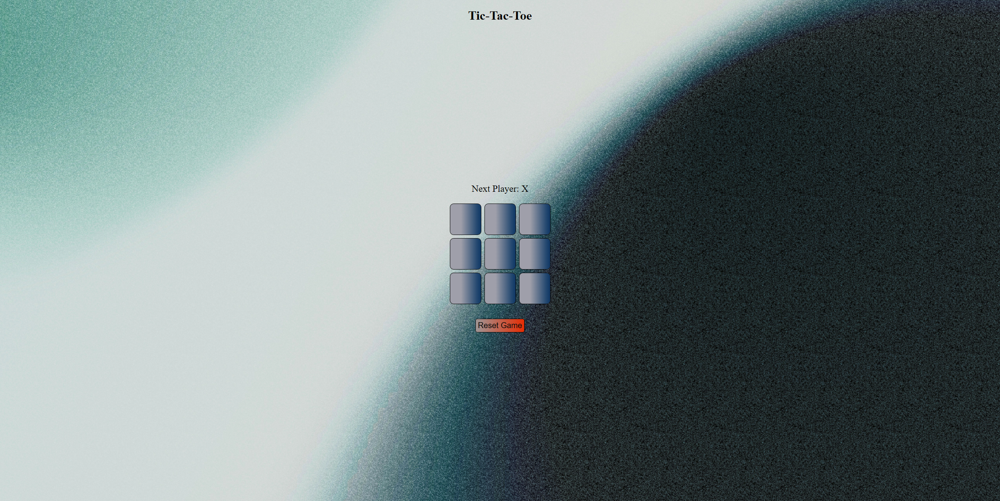

## Overview

### Gameplay Mechanics | (In-Progress)
- Users should be able to choose whether they'd like to play as 'X' or 'O'.
- There should be hover and focus states for interactive elements.
- Users should be able to reset the state of the game at any point.
- The game should correctly display the winning player.
- The game should display that theres a 'Draw' if all slots are filled and there is no winning pattern.

### Screenshot

